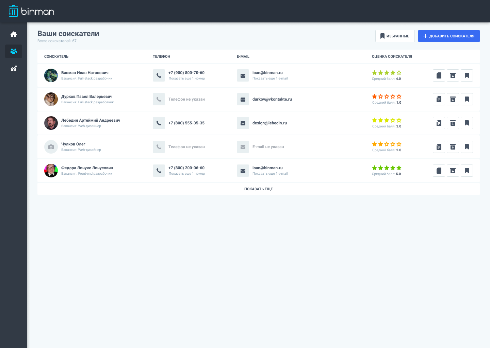

# Пример выполнения тестового задания вакансии с hh.ru

Довольно старое задание (уже не актуально). Остался в проектах в Figma. Взят с сайта hh.ru из вакансии выложенной компанием Бинман.
Все права на макет принадлежат компании Бинман. В этом репозитории выполнена только верстка данного макета.

На всякий случай максимально садаптировал отображение таблицы на маленьких экранах.

К сожалению верстка выполнена не до конца. Как только выдастся время поправлю недочеты, связанные с отображением бокового меню на мобильных экранах, а также необходимо провести рефакторинг кода.

[Демонстрация верстки](https://heknt90.github.io/test-task-vacancy-binman/) |
[Ссылка на макет](https://www.figma.com/file/WM4oyMFV9EuMHfkMzYGBD0/2019-11-04-test?node-id=0%3A1/)

В процессе верстки использовались:

- HTML5;
- CSS3;
- JavaScript (для открытия бокового меню);
- БЭМ именование;
- Pixel Perfect для исходного разрешения экрана;
- Сервис по сжатию изображений;
